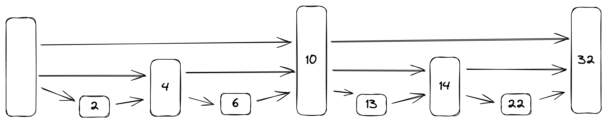

## A "Skip List" implementation for educational purposes.

It is a data structure that have efficient update and search abilities.

### Search

From top level to down search.
Levels are randomized in list.
Complexity is O(logn)

Dry-Code Steps;

Search(22)

From Top level to Down check values;

22 >= 10 - TRUE

GOTO 10

22 >= 32 - FALSE

DOWN LEVEL

22 >= 14 - TRUE

GOTO 14

22 >= 32 - FALSE

DOWN LEVEL

22 >= 22 - FOUND
